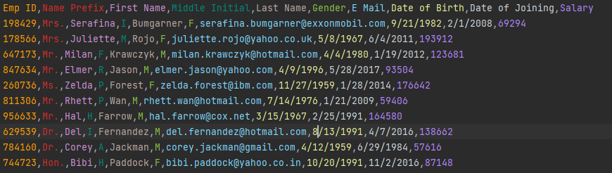
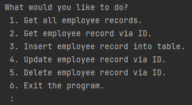
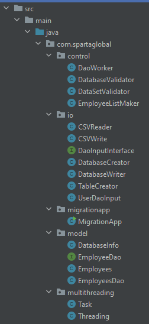
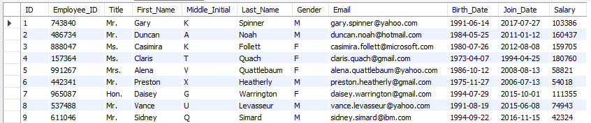
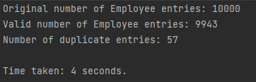
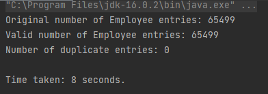

# `Java` Employee-CSV-Migration

Provided is a small implementation of a program that migrates data from a CSV file to a database. A user is also given the ability to create, read, update and delete records from the database. Currently the program is tailored for a specific .csv file and object of employee data.

---

### Table of Contents :
- ##### Detailed run through.
- ##### Program structure.
- ##### Tools used.
- ##### The database.
- ##### Model.
- ##### IO
- ##### Control.
- ##### Multi-threading.
- ##### Migration app.
- ##### Testing.
- ##### Future additions.
- ##### Some thoughts.

---

## Detail run through

On run the program will read from a .csv file containing employee data.

__Data Example:__

This data is read in line by line as string and `List.split(",")` is used to separate the data and add it to an array. The data is then checked to see if it is valid data and dates reformatted, to be an added to a bespoke Employees object. These Employees objects are then stored in an `ArrayList<Employees>` of Employees. Duplicate records are subsequently removed.

From here the program interfaces with a locally hosted database running **_MySQL_** using the Java Database Connectivity **_(JDBC)_**.

An Employee database is then created if there isn't one that already exists.

A table is also made and populated with the results from the if there isn't already a table that exists. If a table already exists the user will be prompted as to whether they want to `DROP` and create and popular a fresh instance of the table or whether they want to do nothing. When data is added to the database multi-threading is used to reduce processing time.

Once the database and tables are up and ready to be accessed the user is then prompted with various options. Including:

__Options UI:__

Option `1` will output the database data to a .csv file and requires no further input. Options `2` and `5` only require a valid, existing employee ID to carry out their function. Option `3` requires a full valid set of data to be inserted into the table. While option `4` requires the data that will replace the currently existing data and the ID of the employee to it will go to. Option `6` simply suspends the program.

As the user is allowed to decide to not drop the table on each run as long as they don't choose to the results of their CRUD actions will persist in the database.

---

## Program structure

The program `java` code is split into 5 packages consisting of:

- Migration App
- Model
- IO
- Control
- Multithreading

__Packages and classes:__

The application uses **_Maven_** to manage the products build. **_Log4j_** for logging and **_JUnit_** for testing classes and methods. MVC design considerations have also been taken into account and includes a database access object. As mentioned before the program also makes use of **_JDBC_** to connect to a database.

---

## Tools used

- IntelliJ IDE : as my code environment.
- Maven : as my program manager.
- JDBC : to allow database connectivity.
- JUnit : for testing my methods.
- Git : for local version control.
- GitHub : for remote version control.
- MySQL and MySQL Workbench : for database querying and visualisation.
- Kleopatra and GnuPG : for managing certificates so I can verify my commits.
- Atom : to write READMEs.

---

## The Database

__Example employee records:__

The database as mentioned before runs MySQL and these results have been queried in MySQL Workbench. To access the local host a username : **_root_** and password are required. These details and the host url also need to be provided to the program to allow for connectivity.

---

### Model

The model package consists of the Employees and DAO object. It also contains the info that the program requires to access the database. These can be seen in the project files in the GitHub repository.

---

### IO

The IO package consists of the classes and methods that read and write to provided or created files, creates the database, tables and receives the user input for CRUD actions.

---

### Control

The Control package consists of the classes and methods that carries out CRUD choices, database and dataset validation methods and the method that creates the Employee arraylist.

---

### Multithreading

The Multithreading package consists of the methods to create and manage threads to allow for multi-threading of table populating. It also contains the timer for the period of time the multi-threading takes. to carry this out the program makes use of the `ExecutorService` interface. It was important to use this as due to thread workload, the recorded time would be too short with generic multithreading calls and loops. This was solved with the usage of the mentioned method. The program does not make use of batch commits. But still is able to process at ample speed.

The program usually reads in from two different .csv files. A small one consisting of **_9943_** unique records and a large one consisting of **_65499_** unique records.

At best and current implementation of the program has been witnessed to write the records to the databases at these speeds:

__Small .csv file:__

__Large .csv file:__

These speeds however are not consistent and it has been observed to be affected by other computer workloads or constant querying of the database during writing.

---

### Testing

Most testing was deemed to be a failure as many methods required `Scanner` input from the user and/or querying of the database which hindered my testing due to available project time and the inability to enter data from the console as on run of a test the console is put into read-only mode.

Some testing was complete though. Mostly in terms of data validation.

---

### Future additions

- The ability to add program recursion for the user so they don't have to run the program again to do more CRUD, on previous trial of this it was observed that CRUD actions were not persisting to the database.

- The ability create custom objects which haven't been previously defined so as to create new databases and tables and allow reading from other data sources.

- A GUI.

-  Make use of lambda expressions and streams to further increase the readability and processing speed of my program.

- Time comparisons between single and multi-threading.

- Making use of duplicate records.

---

### Some thoughts

Making use of TDD for this project was seemingly impossible, more experience with previous implementations will be necessary. Variable readability is very important as a significant amount of errors occurred due to accidently passing the wrong data and not being able to figure out where I went wrong. I previously deleted my code for checking whether a database and a table already exists as SQL already has queries for those needs. Luckily I had saved that code elsewhere in a Notepad++ file as the code for checking whether a table already exists was key in allowing proper CRUD database persistence.
